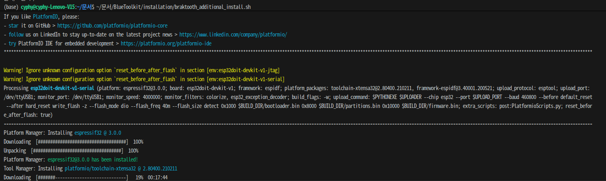

# 20260219 진행현황

## ESP32 설정

처음 ESP32를 연결했을때, USB-C 케이블 불량으로 우분투에서 인식이 되지 않았습니다. 따라서 잘 작동하는 USB-C 케이블을 준비하시고 ESP32 연결 시도를 해보시는 것을 권장드립니다. 연결한 기기는 ESP32-WROOM-32E입니다. 

BlueToolkit 위키의 Using hardware-based exploits 부분을 참고하여 기기 설정을 진행했습니다. 공식 위키 상의 가이드는 아래와 같습니다:

___ 
Braktooth

You need to buy the following hardware to be able to run the exploits: The installation is partially automated in the toolkit. Consult https://github.com/Matheus-Garbelini/braktooth_esp32_bluetooth_classic_attacks repository for other information.

Once you have needed hardware:
- you need to connect it to your machine
- Then run the following command

```bash
ls -la /dev/tty*
```
- If you see /dev/ttyUSB0 and /dev/ttyUSB1 then the development board is connected and you can start writing to it
- To continue Braktooth installation run the following commands
```bash
chmod +x /usr/share/Btoolkit/installation/braktooth_additional_install.sh
/usr/share/Btoolkit/installation/braktooth_additional_install.sh
```
___

제가 `ls -la /dev/tty*` 커맨드를 실행했을때 ESP32 기기가 `ttyUSB0`로 나왔는데, `BlueToolkit/installation/braktooth_additional_install.sh`를 살펴보니 다음과 같은 커맨드가 있었습니다:
```bash
sudo python3 firmware.py flash /dev/ttyUSB1
```
위 커맨드에서 `ttyUSB1`을 `ttyUSB0`으로 수정하여 `braktooth_additional_install.sh`를 실행하였습니다. 그러나 에러가 지속적으로 발생하였고, 현재 사용 중인 우분투 버전에서 그 문제를 찾을 수 있었습니다.



### Braktooth 내부 requirements2.sh 실행 시 문제

Braktooth 관련 설치 시 `rtl8812au` 드라이버가 필요한데, 이는 우분투 24.04 버전에는 더 이상 존재하지 않는 것을 확인했습니다. 따라서 우분투 22.04를 `lxd`를 사용해 설치 및 실행하고, 이 가상 이미지 위에 다시 BlueToolkit을 설치하는 것을 시도하였습니다. 그러나 VirtualBox와 `lxd` 모두 호스트 머신의 블루투스 및 USB 기기 정보를 가져오는 것이 제한되어있어, 실패했습니다. 

최종적으로 우분투 22.04로 재설치하여 BlueToolkit 및 Braktooth를 재설정하기로 결정했습니다.

